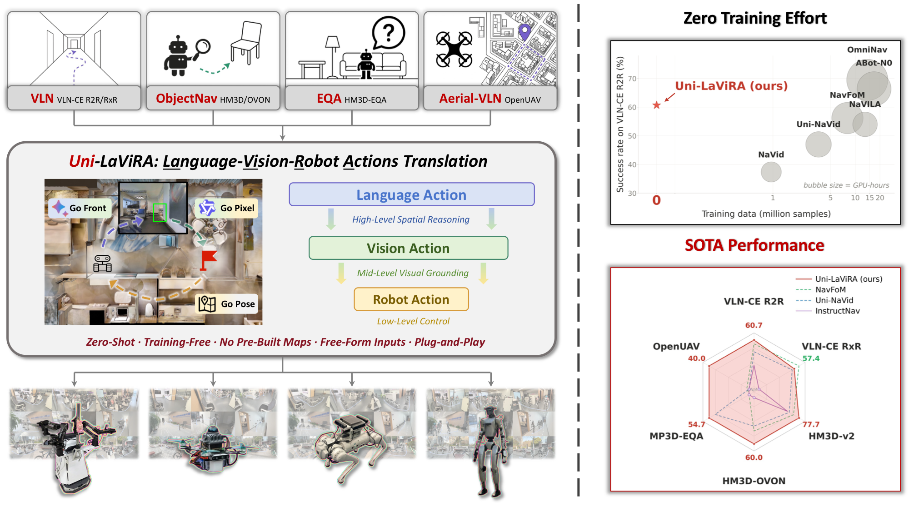

# Uni-LaViRA: Language-Vision-Robot Actions Translation for Unified Embodied Navigation

Uni-LaViRA is a **training-free** framework for **unified embodied navigation**: instead of fine-tuning on millions of robot data and thousands of GPU hours, it casts navigation as a three-layer *translation* — **language → vision → robot action** — where pretrained multimodal LLMs plan in language, ground in vision, and map the result to each robot's low-level controls. One architecture spans four navigation tasks and four heterogeneous robots, yet **matches or even surpasses** trained SOTA navigation foundation models.



## Release TODO List

- [x] Conda environment setup
- [x] Docker environment setup
- [x] Simulation evaluation code
    - [x] VLN — R2R-CE, RxR-CE
    - [x] ObjectNav — HM3D-v2, HM3D-OVON
    - [x] EQA — MP3D-EQA
    - [x] Aerial VLN — OpenUAV
- [x] Real-world deployment code
    - [x] Agilex Cobot Magic
    - [x] Unitree Go1
    - [x] Unitree G1
    - [x] Self-built UAV

## Repository Layout

| Path | Description |
|------|-------------|
| `sim-code/habitat/` | Habitat-based simulation for VLN + ObjectNav + EQA. |
| `sim-code/airsim/`  | AirSim / TravelUAV-based simulation for aerial VLN. |
| `real-world-code/cobot_magic/` | Agilex Cobot Magic deployment. |
| `real-world-code/unitree_g1/`  | Unitree G1 humanoid deployment. |
| `real-world-code/unitree_go1/` | Unitree Go1 quadruped deployment. |
| `real-world-code/self_built_uav/` | Self-built UAV (ROS) deployment. |

## Task × Platform

| Task | Simulation | Real Robots |
|------|-----------|-------------|
| VLN        | `sim-code/habitat` | cobot_magic · unitree_g1 · unitree_go1 · self_built_uav |
| ObjectNav  | `sim-code/habitat` | cobot_magic · unitree_g1 · unitree_go1 · self_built_uav |
| EQA        | `sim-code/habitat` | cobot_magic · unitree_g1 · unitree_go1 · self_built_uav |
| Aerial VLN | `sim-code/airsim`  | self_built_uav |

Each ground robot runs all of `vln` / `object_nav` / `eqa` / `interact` from one shared pipeline and a single LA/VA model; only the instruction differs.

## Quickstart

- **Run simulation evaluation** → `sim-code/habitat/README.md` (indoor) or `sim-code/airsim/README.md` (aerial).
- **Deploy on a real robot** → the README inside the matching `real-world-code/<robot>/` folder.

Each subfolder is self-contained: environment setup, datasets, checkpoints, and run commands all live in its own README. The simulation and real-world trees use separate environments and do not share a single install.

## Citation

```bibtex
@article{ding2026unilavira,
  title={Uni-LaViRA: Language-Vision-Robot Actions Translation for Unified Embodied Navigation},
  author={Ding, Hongyu and others},
  journal={arXiv preprint arXiv:2605.27582},
  year={2026}
}
@article{ding2025lavira,
  title={LaViRA: Language-Vision-Robot Actions Translation for Zero-Shot Vision Language Navigation in Continuous Environments},
  author={Ding, Hongyu and Xu, Ziming and Fang, Yudong and Wu, You and Chen, Zixuan and Shi, Jieqi and Huo, Jing and Zhang, Yifan and Gao, Yang},
  journal={arXiv preprint arXiv:2510.19655},
  year={2025}
}
```

## Acknowledgements

This work builds on [LaViRA](https://github.com/NJU-R-L-Group-Embodied-Lab/lavira-code), [CA-Nav](https://github.com/Chenkehan21/CA-Nav-code), [NavDP](https://github.com/InternRobotics/NavDP), and [Depth-Anything V2](https://github.com/DepthAnything/Depth-Anything-V2). Thanks for their great work!

## License

The open-sourced code is released under the [Creative Commons Attribution-NonCommercial-ShareAlike 4.0 International License (CC BY-NC-SA 4.0)](http://creativecommons.org/licenses/by-nc-sa/4.0/) — see [`LICENSE`](LICENSE). Third-party submodules and vendored components remain under their own upstream licenses.
